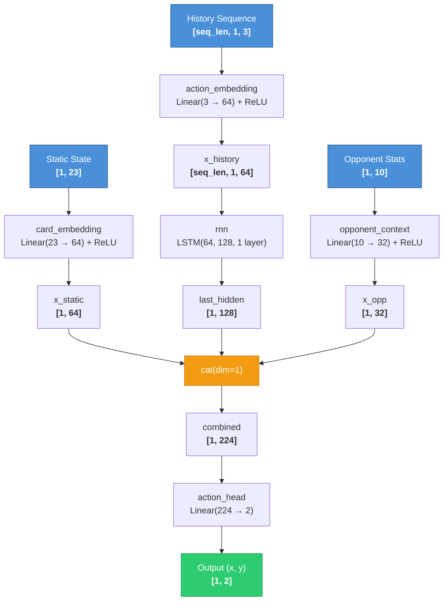

# PokerNet Model Card

## Input Features (Static State Vector) — 34 floats

The game state is converted into a flat tensor of 34 normalized floats via `TensorConverter::infoToTensor()` in `converter.cpp`.

| Index | Feature | Normalization |
|-------|---------|---------------|
| 0 | Hole card 1 rank | (rank - 2) / 12 |
| 1 | Hole card 1 suit | suit / 3 |
| 2 | Hole card 2 rank | (rank - 2) / 12 |
| 3 | Hole card 2 suit | suit / 3 |
| 4-5 | Board card 1 (rank, suit) | same as above, -1.0 if absent |
| 6-7 | Board card 2 (rank, suit) | same, -1.0 if absent |
| 8-9 | Board card 3 (rank, suit) | same, -1.0 if absent |
| 10-11 | Board card 4 (rank, suit) | same, -1.0 if absent |
| 12-13 | Board card 5 (rank, suit) | same, -1.0 if absent |
| 14 | Pot | pot / big_blind |
| 15 | Stack | stack / big_blind |
| 16 | Call amount | call_amount / big_blind |
| 17 | Current wager | wager / big_blind |
| 18 | Table position | position / (num_players - 1) |
| 19 | Pot equity | raw float (0.0 - 1.0) |
| 20 | Pot odds percentage | raw float (0.0 - 1.0) |
| 21 | M-Ratio | m_ratio / 50 | # what is this
| 22 | Active players | num_active / 9 |
 | 23 |  Assumed Opponent Hand Range | 13x13 matrix of softmaxe'd ins | 
 | 24 |  Seen Opponent Hand Range (showdown ) | 13x13 matrix of softmaxe'd ins | # might be useless 
| 25 |  Opponent Hand Bucket | 3 or 4 enumerations |
| 26 | Vpip 10 | voluntarily put (money) into pot |
| 27 | Vpip 30 | voluntarily put (money) into pot | 
| 28 | Vpip 50 | voluntarily put (money) into pot | 
| 29 | Vpip 100 | voluntarily put (money) into pot| 
| 31 | pfr10  | preflop raising rate| 
| 32 | pfr30  | preflop raising rate| 
| 33 | pfr50  | preflop raising rate| 
| 34 | pfr100  | preflop raising rate| 

> **Note:** Active players (index 22) is included to support future expansion beyond heads-up play. In the current heads-up training mode this value is always 2/9 (~0.22), but it will become meaningful if the model is trained or deployed in multi-player games.

## History Sequence Features — 3 floats per action node

Betting history within the current hand is tracked as a linked list of `ActionNode` structs, converted to a `[seq_len, 1, 3]` tensor via `AIRL::history_to_tensor()` in `ai_rl.cpp`. The list resets on each new deal.

| Feature | Normalization |
|---------|---------------|
| Action command (fold/check/call/raise) | command / 3 |
| Chip amount | chips / 100 |
| Player position | position / 9 |

## Architecture (PokerNet)

Defined in `poker_net.h`. Constructed with `PokerNet(input_size=23, hidden_size=128)`.

**Total trainable parameters**: ~47k

## Training

- **Algorithm**: REINFORCE policy gradient with Gaussian noise exploration (noise_scale = 0.1)
- **Optimizer**: Adam, learning rate 1e-4
- **Training mode**: Self-play (game type 6) — two AIRL agents sharing the same network weights play heads-up, 1000 deals per session, rebuys enabled
- **Evaluation**: Every 10 epochs, a 50-hand heads-up match is run against AISmart(tightness=0.5). The bot's final stack is logged to `training_log.csv`
- **Checkpointing**: Model weights saved as `.pt` files in the `models/` directory after each evaluation
