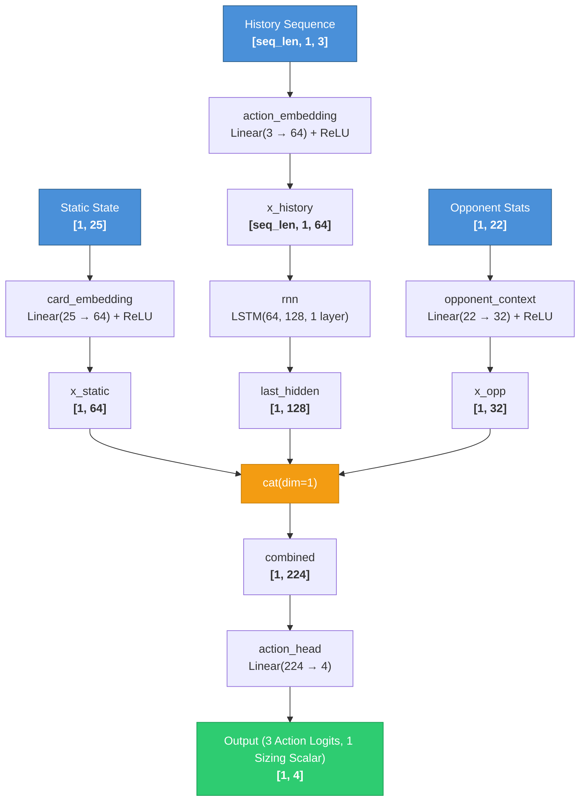

# PokerNet Model Card

## Input Features (Static State Vector) — 47 floats

The game state is converted into a flat tensor of 47 normalized floats via `TensorConverter::infoToTensor()` in `converter.cpp`.

| Index | Feature | Normalization |
|-------|---------|---------------|
| 0 | Hole card 1 rank | (rank - 2) / 12 |
| 1 | Hole card 1 suit | suit / 3 |
| 2 | Hole card 2 rank | (rank - 2) / 12 |
| 3 | Hole card 2 suit | suit / 3 |
| 4-5 | Board card 1 (rank, suit) | same as above, -1.0 if absent |
| 6-7 | Board card 2 (rank, suit) | same, -1.0 if absent |
| 8-9 | Board card 3 (rank, suit) | same, -1.0 if absent |
| 10-11 | Board card 4 (rank, suit) | same, -1.0 if absent |
| 12-13 | Board card 5 (rank, suit) | same, -1.0 if absent |
| 14 | Pot | pot / big_blind |
| 15 | Stack | stack / big_blind |
| 16 | Call amount | call_amount / big_blind |
| 17 | Current wager | wager / big_blind |
| 18 | Table position | position / (num_players - 1) |
| 19 | Pot equity | raw float (0.0 - 1.0) |
| 20 | Pot odds percentage | raw float (0.0 - 1.0) |
| 21 | M-Ratio | m_ratio / 50 | 
| 22 | Active players | num_active / 9 |
| 23 | Board Texture | 0-1 mapped enumerated types |
| 24 | Opponent Range Type | 0-1 mapped enumerated types |
| 25-31| Opponent HandBand Probabilities | 7 probability floats (mapped from 1326 combination tracking) |
| 32 | Hand VPIP (Live) | 1.0 if voluntarily put money in pot during current hand |
| 33 | Hand PFR (Live) | 1.0 if raised preflop during current hand |
| 34 | History is Empty | 1.0 if no prior betting action on street |
| 35-38| Vpip 10/30/50/100 | voluntarily put (money) into pot moving averages | 
| 39-42| Pfr 10/30/50/100 | preflop raising rate moving averages | 
| 43-46| Donk 10/30/50/100 | donk betting rate moving averages | 

> **Note:** Active players (index 22) is included to support future expansion beyond heads-up play. In the current heads-up training mode this value is always 2/9 (~0.22), but it will become meaningful if the model is trained or deployed in multi-player games.

## History Sequence Features — 3 floats per action node

Betting history within the current hand is tracked as a linked list of `ActionNode` structs, converted to a `[seq_len, 1, 3]` tensor via `AIRL::history_to_tensor()` in `ai_rl.cpp`. The list resets on each new deal.

| Feature | Normalization |
|---------|---------------|
| Action command (fold/check/call/raise) | command / 3 |
| Chip amount | chips / 100 |
| Player position | position / 9 |

## Architecture (PokerNet)

Defined in `poker_net.h`. Constructed with `PokerNet(input_size=25, hidden_size=128)`.

```mermaid
graph TD
    %% Inputs
    S["Static State<br/><b>[1, 25]</b>"]
    H["History Sequence<br/><b>[seq_len, 1, 3]</b>"]
    O["Opponent Stats<br/><b>[1, 22]</b>"]

    %% Static branch
    S --> CE["card_embedding<br/>Linear(25 → 64) + ReLU"]
    CE --> XS["x_static<br/><b>[1, 64]</b>"]

    %% History branch
    H --> AE["action_embedding<br/>Linear(3 → 64) + ReLU"]
    AE --> XH["x_history<br/><b>[seq_len, 1, 64]</b>"]
    XH --> LSTM["rnn<br/>LSTM(64, 128, 1 layer)"]
    LSTM --> LH["last_hidden<br/><b>[1, 128]</b>"]

    %% Opponent branch
    O --> OC["opponent_context<br/>Linear(22 → 32) + ReLU"]
    OC --> XO["x_opp<br/><b>[1, 32]</b>"]

    %% Concatenation
    XS --> CAT["cat(dim=1)"]
    LH --> CAT
    XO --> CAT
    CAT --> COMB["combined<br/><b>[1, 224]</b>"]

    %% Output
    COMB --> AH["action_head<br/>Linear(224 → 4)"]
    AH --> OUT["Output (3 Action Logits, 1 Sizing Scalar)<br/><b>[1, 4]</b>"]

    %% Styling
    style S fill:#4a90d9,stroke:#2c5f8a,color:#fff
    style H fill:#4a90d9,stroke:#2c5f8a,color:#fff
    style O fill:#4a90d9,stroke:#2c5f8a,color:#fff
    style OUT fill:#2ecc71,stroke:#1a9c54,color:#fff
    style CAT fill:#f39c12,stroke:#c87f0a,color:#fff
```

**Total trainable parameters**: ~48k

## Training

- **Algorithm**: REINFORCE policy gradient with Gaussian noise exploration (noise_scale = 0.1)
- **Optimizer**: Adam, learning rate 1e-4
- **Training mode**: Self-play (game type 6) — two AIRL agents sharing the same network weights play heads-up, 1000 deals per session, rebuys enabled
- **Evaluation**: Every 10 epochs, a 50-hand heads-up match is run against AISmart(tightness=0.5). The bot's final stack is logged to `training_log.csv`
- **Checkpointing**: Model weights saved as `.pt` files in the `models/` directory after each evaluation
