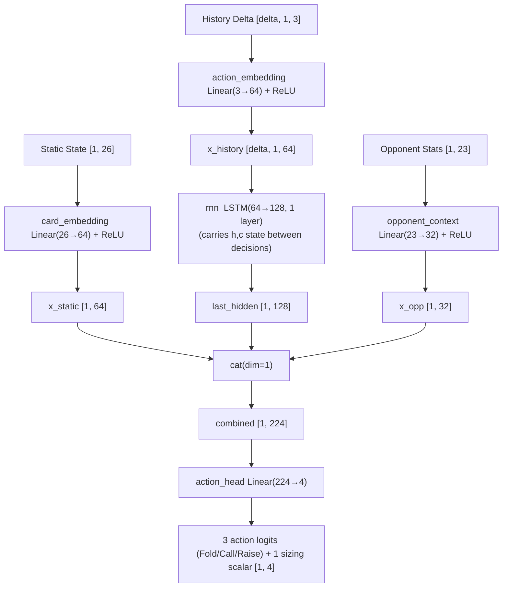

# PokerNet Model Card

## Input Features — 49 floats total

The game state is converted into a flat tensor of 49 normalized floats via `TensorConverter::infoToTensor()` in `converter.cpp`, then split into a static branch (26 floats) and an opponent-stats branch (23 floats).

### Static State — indices 0–25 (26 floats)

| Index | Feature | Normalization |
|-------|---------|---------------|
| 0 | Hole card 1 rank | (rank − 2) / 12 |
| 1 | Hole card 1 suit | suit / 3 |
| 2 | Hole card 2 rank | (rank − 2) / 12 |
| 3 | Hole card 2 suit | suit / 3 |
| 4–5 | Board card 1 (rank, suit) | same as above; −1.0 if absent |
| 6–7 | Board card 2 (rank, suit) | same; −1.0 if absent |
| 8–9 | Board card 3 (rank, suit) | same; −1.0 if absent |
| 10–11 | Board card 4 (rank, suit) | same; −1.0 if absent |
| 12–13 | Board card 5 (rank, suit) | same; −1.0 if absent |
| 14 | Pot | pot / big_blind |
| 15 | Stack | stack / big_blind |
| 16 | Call amount | call_amount / big_blind |
| 17 | Current wager | wager / big_blind |
| 18 | Table position | position / (num_players − 1) |
| 19 | Pot equity | raw float (0–1) |
| 20 | Pot odds percentage | raw float (0–1) |
| 21 | Active players | num_active / 9 |
| 22 | Board texture | enumerated 0–6, normalized / 6 |
| 23 | Opponent range type | enumerated 0–2 (uniform/linear/polar), normalized / 2 |
| 24 | **Relative bet sizing** | call_amount / pot, capped at 2×, normalized 0–1 |
| 25 | **Street** | 0=preflop, 1=flop, 2=turn, 3=river, normalized / 3 |

> Features 24–25 were added to enable sizing-tell detection and street-specific strategy learning.

### Opponent Stats — indices 26–48 (23 floats)

Tracked per-opponent across hands in `AIRL::OpponentTracker`. All window stats persist across hands; live flags reset each hand.

| Index | Feature | Notes |
|-------|---------|-------|
| 26–32 | Opponent HandBand probabilities (7 floats) | P(Air), P(WeakDraw), P(StrongDraw), P(WeakMade), P(MidMade), P(StrongMade), P(Nuts) — derived from Bayesian range narrowing over 1326 combos, recomputed on street change only |
| 33 | Hand VPIP (live) | 1.0 if opponent voluntarily put money in pot this hand |
| 34 | Hand PFR (live) | 1.0 if opponent raised preflop this hand |
| 35 | History empty | 1.0 if no prior action in history LSTM |
| 36–39 | VPIP at 10/30/50/100 hands | Moving window rates |
| 40–43 | PFR at 10/30/50/100 hands | Moving window rates |
| 44–47 | Donk bet rate at 10/30/50/100 hands | Moving window rates |
| 48 | **Avg raise size (BB EMA)** | EMA (α=0.1) of opponent's raise amounts in BB units, capped at 10 BB, normalized 0–1. Detects sizing tells: opponents who bet large with strong hands drift this value high. |

## History Sequence Features — 3 floats per action step

Betting history is tracked incrementally as a linked list of `ActionNode` structs in `AIRL`. The LSTM hidden state `(h, c)` is carried forward between decisions within a hand (O(1) per decision), reset to zeros at each new deal.

| Feature | Normalization |
|---------|---------------|
| Action command (fold/check/call/raise) | command / 3 |
| Chip amount | chips / 100 |
| Player position | position / 9 |

> **Performance note:** Hidden state is now carried incrementally (`forward_with_state`), eliminating the O(n²) full-history reprocessing that caused training slowdown after extended sessions.

## Architecture (PokerNet)

Defined in `poker_net.h`. Constructed with `PokerNet(input_size=26, hidden_size=128)`.

```mermaid
graph TD
    S["Static State [1, 26]"]
    H["History Delta [delta, 1, 3]"]
    O["Opponent Stats [1, 23]"]

    S --> CE["card_embedding  Linear(26→64) + ReLU"]
    CE --> XS["x_static [1, 64]"]

    H --> AE["action_embedding  Linear(3→64) + ReLU"]
    AE --> XH["x_history [delta, 1, 64]"]
    XH --> LSTM["rnn  LSTM(64→128, 1 layer)\n(carries h,c state between decisions)"]
    LSTM --> LH["last_hidden [1, 128]"]

    O --> OC["opponent_context  Linear(23→32) + ReLU"]
    OC --> XO["x_opp [1, 32]"]

    XS --> CAT["cat(dim=1)"]
    LH --> CAT
    XO --> CAT
    CAT --> COMB["combined [1, 224]"]

    COMB --> AH["action_head  Linear(224→4)"]
    AH --> OUT["3 action logits (Fold/Call/Raise) + 1 sizing scalar [1, 4]"]
```

**Total trainable parameters**: ~48k

**Action head initialization**: weights ~ N(0, 0.01), all biases = 0. No prior toward any action — the reward signal alone determines policy.

## Training

### Algorithm
REINFORCE policy gradient with Gaussian noise exploration.

- **Optimizer**: Adam with weight decay 1e-4
- **Learning rate**: decays 1e-3 → 1e-4 over 10,000 epochs
- **Noise**: decays 0.3 → 0 over first 1,000 epochs, then 0
- **Entropy coefficient**: 0.001 for epochs 0–999, decays to 0.0001 floor for epochs 1000–3000+
- **Gradient clipping**: per-hand clip at 1.0, per-epoch clip at 1.0

### Distillation Phase
The model first trains against a rotating pool of rule-based opponents (AISmart, AIRandom, AIEvolved, AICall) until it achieves ≥80% sub-game win rate over a 5-epoch rolling window. This bootstraps basic poker understanding before self-play.

### Self-Play Phase
Two `AIRL` agents sharing the same network weights play heads-up. Each epoch runs 500 hands across one or more sub-games (sub-game resets when a player busts). Gradients accumulate across all 500 hands; a single optimizer step is taken per epoch.

### Reward Signal
Per-hand REINFORCE with baseline subtraction:
- `reward = (chips_won − chips_invested) / buy_in × survival_factor`
- `survival_factor = 0.5` if stack fell below 20% of buy-in during the hand, else 1.0
- Advantage = reward − exponential moving baseline (α=0.01)

### Evaluation
Every 10 epochs: 50-hand heads-up match vs `AISmart(0.5)`. Final stack logged to `training_log.csv` and `logs/rl/training_metrics.csv`.

### Checkpointing
Saved as `.pt` files in `./logs/rl/`. Resume by selecting a checkpoint at startup.

> **Checkpoint compatibility**: Input size changed to 49 in the current version. Old checkpoints trained with 46-feature input are incompatible and must be discarded.
